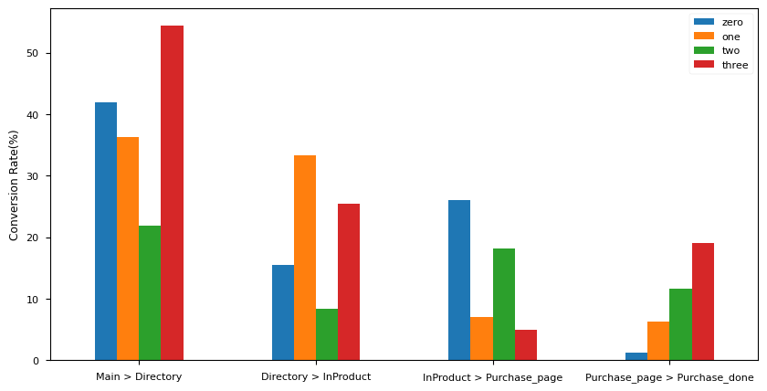
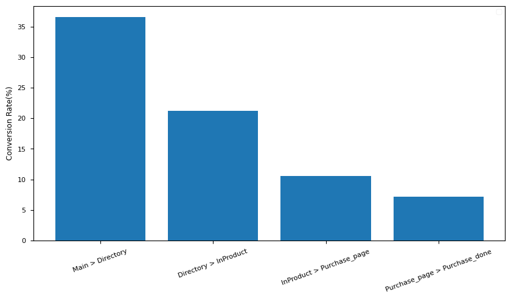

## Funnel Analysis

### 1. 퍼널 분석 배경 소개
가상의 상황을 가정해서 진행한다. 데이터 분석 팀에 다음과 같은 요청이 들어왔다. 유저들이 잘 사용하고 있는지 확인하고 싶다. 잘 사용하고 있다면 그 기능이 무엇인지 알고 싶다. 이탈이 많다면, 어느 구간을 개선해야 할 지와 어떤 방법으로 개선하면 좋을 지 알려달라.

### 2. 문제 및 목적 정의
**문제 정의**
* 유저 사용성 현황을 파악한다.
* 단계별 전환율을 파악해 이탈률이 큰 구간을 찾고, 이에 대한 개선 방안을 도출한다.

**목적 정의**
* 단계별 이탈률이 높은 구간을 파악하고 개선해서 유저 사용 경험을 개선한다.

### 3. 결론
유저들의 이탈률 개선이 필요한 구간은 다음과 같다.
* Group 0 - 구매 > 구매 확정
* Group 1 - 제품 > 구매 / 구매 > 구매 확정
* Group 2 - 디렉토리 > 제품
* Group 3 - 제품 > 구매

그리고, 그룹마다의 이탈률 개선을 위한 해결 방안은 다음과 같다.

**Group 0**
* 구매 > 구매 확정 - 리마인드 캠페인과 더불어 즉시 사용해야 하는 시간제한 혜택 등으로 빠른 구매 결정을 내릴 수 있도록 유도하는 액션이 필요합니다.

**Group 1**
* 제품 > 구매 - 구매 욕구를 불러일으키는 데에 집중해야 합니다. 조회한 상품과의 연관 상품을 추천하거나, 구매 시 사용 가능한 혜택을 제시함으로써 바로 구매할 수 있도록 유도하는 방법을 제안한다.
* 구매 > 구매 확정 - 리마인드 캠페인과 더불어 즉시 사용해야 하는 시간제한 혜택 등으로 빠른 구매 결정을 내릴 수 있도록 유도하는 액션이 필요합니다.

**Group 2**
* 디렉토리 > 제품 - 인기가 많은 상품을 소개함으로써 상품 상세페이지를 조회하도록 유도합니다. 상품 추천 메시지에 상품별 특징을 활용해 주력상품과 베스트 상품 등을 추천해서 상세 페이지를 조회할 확률을 높인다.

**Group 3**
* 제품 > 구매 - 구매 욕구를 불러일으키는 데에 집중해야 합니다. 조회한 상품과의 연관 상품을 추천하거나, 구매 시 사용 가능한 혜택을 제시함으로써 바로 구매할 수 있도록 유도하는 방법을 제안한다.

### 4. 데이터 분석 결과
데이터 분석 결과 목차
* 유저의 사용성 현황
* 전체 유저의 구간별 전환율 현황
* 클러스터링 진행과 이에 따른 클러스터별 전환율 차이

**유저의 사용성 현황**
* 유저들은 대부분 평일에 사용하고, 주말에 사용량이 줄어든다.
* 주요 문서를 실행하는 위치는 Other App 이다.
* 유저들은 주로 Open, Close 기능을 사용하고 있다.
* 주로 사용하는 문서는 PDF, XLS, DOC 이다.

**전체 유저의 구간별 전환율**
* 메인 페이지 > 디렉토리 페이지 (36.5%)
* 디렉토리 페이지 > 제품 페이지 (21.3%)
* 제품 페이지 > 구매 페이지 (10.6%)
* 구매 페이지 > 구매 확정 페이지 (7.2%)

**클러스터링 진행과 이에 따른 클러스터별 전환율 차이**

전체적인 특징과 별개로 사용자들의 특징에 따라 고객을 구분하면, 주목할만한 특징이 발견될거라 생각했다. 주어진 데이터 특징 중에 파일의 종류에 따라 성격이 다르다고 생각해서 확장자(ext)를 토대로 고객을 4개로 분류했다.

단계별 전환율이 분할된 고객 그룹에 따라 다르게 나타나는 것을 확인할 수 있다. 분석 결과를 활용하여 그룹마다 집중해야 하는 구간과 이에 따른 전략이 달라진다.
